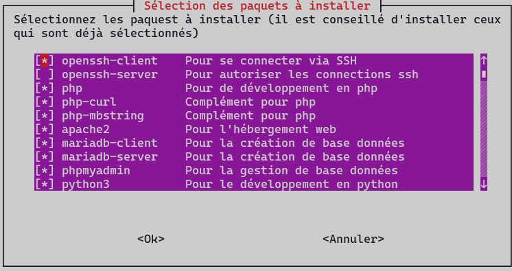

<p align="center">
    
</p>
<h1 align="center">PostInstall</h1>

Un script post installation pour GNU/Linux.  

<br/>

> A noter que ce script ne fonctionne que pour les distributions utilisant le gestionnaire de paquet `apt`, celles-ci sont en grande partie les distributions basées sur `Debian`, `Ubunutu`. Ce script est donc compatible avec `Raspbian`.  

<br/>

Le Script permet d'installer les paquets essentiels à une utlisation "power user" de GNU/Linux...

<p align="center">
    
</p>

mais également des programmes non essentiels mais cependant souvent utilisés.


<br/>

---
<br/>

Pour lancer le script :
```bash
$ chmod u+x post_install_APT.sh
```
Donnera la permission au script de s'exécuter.  

```bash
$ ./post_install_APT.sh
```
Exécutera le script
